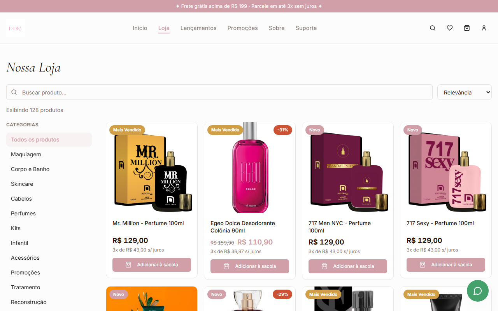
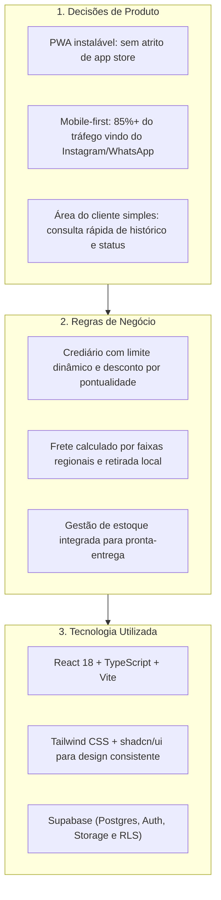

# Esdra Cosméticos — Transformação Digital de um Negócio Real

Plataforma integrada de e-commerce e gestão operacional desenvolvida para a digitalização de uma operação real de cosméticos e perfumaria (MEI).

---

## Narrativa do Projeto


### Contexto
A **Esdra Cosméticos** é uma microempresa real de cosméticos, maquiagem e perfumaria, operando com vendas diretas, consultoria presencial e base de clientes recorrentes.

### O Problema
Antes da digitalização, a operação enfrentava os gargalos típicos do comércio direto tradicional:
- Divulgação dependente de envio manual de fotos e mensagens individuais via WhatsApp.
- Catálogo desatualizado e sem visibilidade em tempo real de disponibilidade de estoque.
- Dificuldade para gerenciar pedidos, cálculo de frete e opções de pagamento.
- Necessidade de preservar um diferencial histórico do negócio: a modalidade de **crediário próprio** com regras específicas de parcelamento e fidelidade para clientes habituais.

### A Solução
Desenvolvimento de uma **solução digital completa sob medida**:
- **Loja Virtual Pública (PWA):** catálogo responsivo de produtos, busca otimizada, carrinho, checkout e área do cliente, funcionando com excelente desempenho no celular.
- **Painel Administrativo:** controle de inventário, pedidos, importação de notas fiscais (NF-e) e gestão de clientes.
- **Módulo de Crediário Próprio:** calculadora com regras de negócio adaptadas às práticas comerciais da loja.

### O Resultado
Uma plataforma operacional em produção ([www.esdracosmeticos.com.br](https://www.esdracosmeticos.com.br/)), reduzindo o tempo de atendimento por cliente e proporcionando uma experiência de compra moderna, ágil e independente.

---

## Demonstração Visual

A interface foi projetada com foco prioritário em dispositivos móveis (*mobile-first*), garantindo navegação fluida para quem compra pelo smartphone:

### Experiência no Desktop e no Celular

| Loja no Celular (Mobile PWA) | Vitrine Desktop |
|:---:|:---:|
|  |  |

### Catálogo e Filtros de Produtos
Navegação por categorias (skincare, cabelos, perfumaria, maquiagem) com busca instantânea e visualização de preços:



---

## Decisões de Produto vs. Regras de Negócio vs. Tecnologia

Para manter clareza de engenharia e foco em resultados comerciais, as escolhas do projeto foram estruturadas em três dimensões distintas:



| Dimensão | Aspecto Implementado | Justificativa |
|---|---|---|
| **Decisão de Produto** | Adoção de PWA (*Progressive Web App*) | Permite ao cliente fixar o ícone da loja na tela inicial do celular sem exigir download em lojas de aplicativos. |
| **Decisão de Produto** | Checkout simplificado em poucas etapas | Redução de taxa de abandono de carrinho para clientes acostumados a compras rápidas via mensagem. |
| **Regra de Negócio** | Calculadora de Crediário | Modelagem da política de parcelamento da loja com desconto condicional na data de vencimento e travas de inadimplência. |
| **Regra de Negócio** | Importação de NF-e e CSV | Atualização rápida de estoque e custos de aquisição direto dos arquivos fiscais dos distribuidores. |
| **Tecnologia** | React + Vite + Tailwind | Criação de interface limpa, de alta velocidade de carregamento e manutenção simples. |
| **Tecnologia** | Supabase (Postgres + RLS) | Camada de dados relacional protegida por políticas de acesso por usuário (*Row Level Security*). |

---

## Funcionalidades Principais

### Para a Cliente
- **Navegação Intuitiva:** busca em tempo real e filtros por categoria (perfumaria, cabelos, cuidados com a pele, corpo e banho).
- **Carrinho e Checkout:** cálculo automático de frete e prazos de entrega.
- **Área da Cliente:** visualização de pedidos anteriores, endereços cadastrados e lista de favoritos.
- **Segurança de Acesso:** autenticação segura via e-mail e recuperação de senha.

### Para a Gestão do Negócio
- **Dashboard:** indicadores de vendas, produtos com estoque crítico e faturamento.
- **Gestão de Catálogo:** cadastro com fotos, variações, marcas e categorias.
- **Controle de Pedidos:** fluxo de status (recebido, pago, separado, despachado, entregue).
- **Controle de Crediário:** acompanhamento de parcelas abertas, limites por cliente e histórico de quitação.

---

## Segurança e Privacidade

- **Proteção Estrita de Dados de Clientes:** Nenhum dado pessoal, nome de cliente, telefone, endereço, CPF ou histórico de compras reais está versionado no código ou exposto publicamente.
- **Políticas RLS:** Todas as tabelas sensíveis de clientes e pedidos no Supabase contam com políticas de isolamento estrito (`auth.uid() = user_id` para clientes e papéis restritos para administração).
- **Credenciais Sanitizadas:** Chaves secretas de backend e tokens de serviço não estão presentes no repositório.

---

## Como Executar Localmente

### Pré-requisitos
- Node.js 18+ e npm.

### Instalação
```bash
git clone https://github.com/josemardp/esdracosmeticos.git
cd esdracosmeticos
npm install
cp .env.example .env   # configurar variáveis do Supabase
npm run dev
```

### Comandos Disponíveis
```bash
npm run dev      # Servidor local de desenvolvimento (http://localhost:5173)
npm run build    # Compilação otimizada para produção
npm test         # Execução de testes automatizados (Vitest)
npm run preview  # Pré-visualização local do build de produção
```

---

## Sobre o Desenvolvimento

Este projeto foi desenvolvido como uma iniciativa pessoal e laboratório de **transformação digital aplicada a um negócio real**, combinando visão de produto, entendimento de processos comerciais e automação.

A implementação técnica foi realizada com **forte suporte de ferramentas de Inteligência Artificial**, atuando na geração de boilerplate, componentes de interface, estilização e rotinas de build. A modelagem do produto, a definição dos requisitos comerciais, a experiência do usuário e a homologação com a operação real foram conduzidas e validadas diretamente pelo autor.

---

## Status do Projeto

- **Estado Atual e Próximos Passos:** Consulte [STATUS.md](STATUS.md) para o acompanhamento contínuo da operação e pendências.
- **Auditoria Técnica (Setembro/2026):** Relatório detalhado disponível em [docs/AUDITORIA-2026-09.md](docs/AUDITORIA-2026-09.md).
- **Histórico de Relatórios Legados:** Consulte [docs/HISTORICO.md](docs/HISTORICO.md).
- **Fase:** Em produção no domínio oficial: [www.esdracosmeticos.com.br](https://www.esdracosmeticos.com.br/)
- **Build de Produção:** 100% aprovado.
- **PWA:** Ativo com service workers e manifesto instalável.
